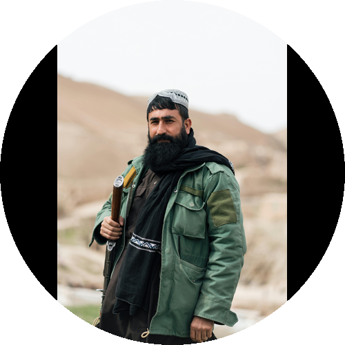
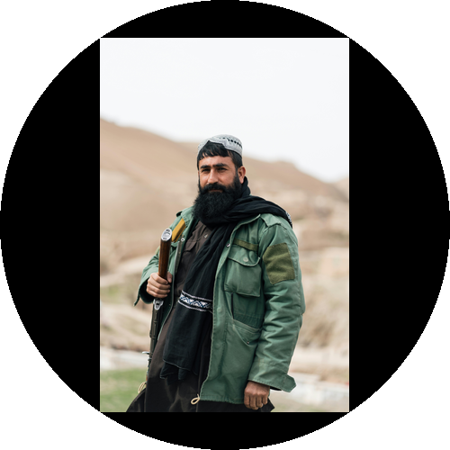

# Circle Images Converter | 圆形图片转换工具

A powerful batch circular image conversion tool with multiple processing modes and intelligent feature detection.

一个功能强大的批量圆形图片转换工具，支持多种处理模式和智能特征检测。

## Features | 主要特点

- 🎯 Three processing modes: Default, Fit-corners, and Face detection
  三种处理模式：默认模式、四角相切模式和人脸检测模式

- 🖼️ Multiple image formats support: PNG, JPG/JPEG, BMP, GIF, WebP, TIFF, JFIF
  支持多种图片格式：PNG、JPG/JPEG、BMP、GIF、WebP、TIFF、JFIF

- 👤 Smart face detection: Automatically detect and center faces
  智能人脸检测：自动识别并居中人脸

- 🔍 Feature detection: Support front face, profile face, eyes, and mouth detection
  特征检测：支持正面人脸、侧面人脸、眼睛和嘴巴检测

- 📏 Flexible size settings: Support pixels(px), millimeters(mm), centimeters(cm)
  灵活的尺寸设置：支持像素(px)、毫米(mm)、厘米(cm)

- 🎨 Transparent background: Perfect for various use cases
  透明背景支持：完美适配各种使用场景

- 🔄 Batch processing: Process entire folders of images
  批量处理：支持整个文件夹的图片批量转换

- 👁️ Real-time preview: Preview processing effects
  实时预览：可以预览处理效果

- ✨ Manual mode: Interactive processing mode selection
  手动模式：支持交互式选择处理方式

## Processing Modes Examples | 处理模式示例

### 1. Default Mode | 默认模式
Maintains image proportion and makes the long edge tangent to the circle.
默认模式会保持图片比例，并使图片的长边与圆形相切。



### 2. Fit-corners Mode | 四角相切模式
Ensures the original image is fully displayed with corners touching the circle.
四角相切模式会确保原图完整显示，并使图片的四个角与圆形相切。



### 3. Face Detection Mode | 人脸检测模式
Automatically detects face position and centers it, ideal for avatars.
人脸检测模式会自动识别人脸位置并居中，适合处理头像。


## Usage | 使用方法

### Basic Commands | 基本命令

```bash
# Default mode | 默认模式
python circle_image_converter.py

# Fit-corners mode | 四角相切模式
python circle_image_converter.py --fit

# Face detection mode | 人脸检测模式
python circle_image_converter.py --face

# Face detection mode (manual selection) | 人脸检测模式（手动选择）
python circle_image_converter.py --face --manual
```

### Advanced Options | 高级选项

```bash
# Custom size and DPI | 自定义尺寸和DPI
python circle_image_converter.py --size 1000px --dpi 300

# Add mode prefix to output filename | 添加模式前缀到输出文件名
python circle_image_converter.py --prefix

# Enable preview window | 启用预览窗口
python circle_image_converter.py --preview
```

## Command Line Arguments | 命令行参数说明

- `--size`: Set circular canvas size (default: 500px)
  设置圆形画布尺寸（默认：500px）
  - Supported units | 支持单位：px（像素）、mm（毫米）、cm（厘米）
  - Examples | 示例：`--size 500px`、`--size 50mm`、`--size 5cm`

- `--dpi`: Set output image DPI (default: 300)
  设置输出图片DPI（默认：300）

- `--fit`: Enable fit-corners mode
  启用四角相切模式

- `--face`: Enable face detection mode
  启用人脸检测模式

- `--preview`: Enable processing preview window
  启用处理过程预览窗口

- `--prefix`: Add mode prefix to output filename
  在输出文件名添加模式前缀

- `--manual`: Enable manual selection mode (requires `--face`)
  启用手动选择模式（需要同时使用`--face`）

- `--input-format`: Specify input image format (default: PNG)
  指定输入图片格式（默认：PNG）

- `--output-format`: Specify output image format (default: PNG)
  指定输出图片格式（默认：PNG）

## Manual Mode Operation | 手动模式操作说明

In manual mode (using `--face --manual` parameter), you can:
在手动模式下（使用`--face --manual`参数），您可以：

1. Press `1`: Select face detection mode
   按 `1` 键：选择人脸检测模式

2. Press `2`: Select default mode
   按 `2` 键：选择默认模式

3. Press `3`: Select fit-corners mode
   按 `3` 键：选择四角相切模式

4. Press `ESC`: Skip current image
   按 `ESC` 键：跳过当前图片

## Supported File Formats | 支持的文件格式

### Input Formats | 输入格式
- PNG
- JPG/JPEG
- BMP
- GIF (first frame only | 仅处理第一帧)
- WebP
- TIFF
- JFIF

### Output Formats | 输出格式
- PNG (recommended, supports transparency | 推荐，支持透明背景)
- JPEG
- BMP
- WebP
- TIFF
- JFIF

## Notes | 注意事项

1. PNG format is recommended for output to maintain transparency
   建议使用PNG格式输出以保持透明背景

2. Face detection effectiveness may be affected by image quality, lighting, and angle
   人脸检测效果可能受图片质量、光线、角度等因素影响

3. For processing large quantities of images, it's recommended to disable the preview window for better speed
   处理大量图片时建议关闭预览窗口以提高处理速度

4. Output DPI affects actual pixel size: actual pixels = size * (dpi/300)
   输出DPI会影响实际像素大小：实际像素 = size * (dpi/300)